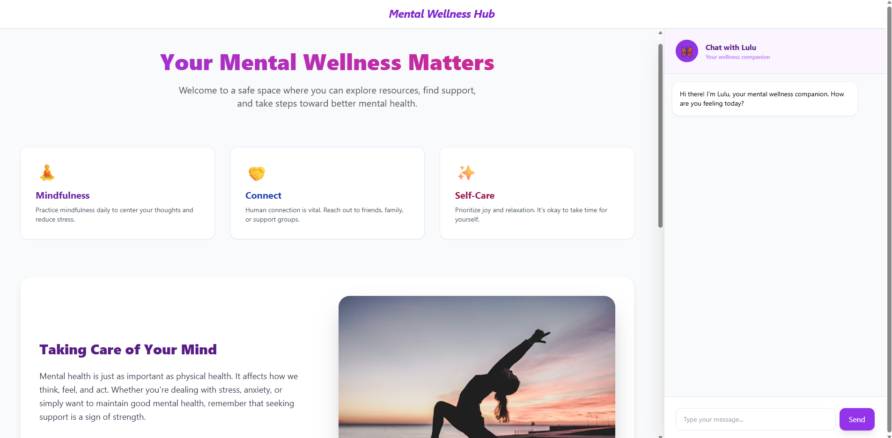

# 🌿 Mental Wellness Hub & AI Companion (Lulu)

A full-stack web application that provides a safe, supportive space for users to explore mental wellness resources and interact with an AI-powered companion in real time.

Overview

**Mental Wellness Hub** is designed to bridge the gap between static mental health resources and real-time support. It combines curated wellness content with an intelligent chatbot (**Lulu**) that offers empathetic, context-aware responses.

> 💡 Built with a focus on **user safety, ethical AI use, and accessibility**

## 🎯 Features

*  **AI Chat Companion (Lulu)**
  Real-time conversational support using AI

*  **Mental Wellness Support**
  Encouraging messages, coping strategies, and check-ins

*  **Crisis Detection System**
  Detects sensitive keywords (e.g., “help”, “suicide”) and provides immediate, predefined support resources

*  **Fast & Responsive UI**
  Clean interface with a persistent chat sidebar

*  **Secure API Handling**
  Environment variables used to protect API keys

## Tech Stack

* **Frontend:** HTML5, Tailwind CSS, JavaScript
* **Backend:** Node.js, Express.js
* **AI Integration:** OpenAI API (`gpt-4o-mini`)
* **Environment:** dotenv
* **Other:** CORS

---

## 📸 Preview



## ⚙️ Getting Started

### 1. Clone the Repository

```bash
git clone https://github.com/your-username/wellness-hub.git
cd wellness-hub
```

### 2. Install Dependencies

```bash
npm install
```

### 3. Set Up Environment Variables

Create a `.env` file in the root directory:

```env
OPENAI_API_KEY=your_api_key_here
```

### 4. Run the Server

```bash
node server.js
```

### 5. Open in Browser

```
http://localhost:5000
```

## 🧪 How It Works

1. User sends a message through the chat interface
2. Backend receives the request via Express API
3. Safety filter checks for crisis-related keywords
4. If safe → request is sent to AI API
5. AI generates a response → sent back to user


## 🛡️ Safety & Ethics

This project includes a **deterministic safety layer** to handle crisis-related input before it reaches the AI.

> ⚠️ **Disclaimer:**
> This application provides general wellness support and is not a substitute for professional medical or psychological advice.

## 🧠 What I Learned

* Building a full-stack application using JavaScript (frontend + backend)
* Integrating AI APIs into real-world applications
* Designing systems with **ethical considerations and safety mechanisms**
* The difference between **deterministic logic vs AI-generated responses**
* Debugging API communication and handling errors effectively

## 🔮 Future Improvements

* User authentication and personalization
* Chat history storage
* Voice-based interaction
* Integration with real mental health resources or services